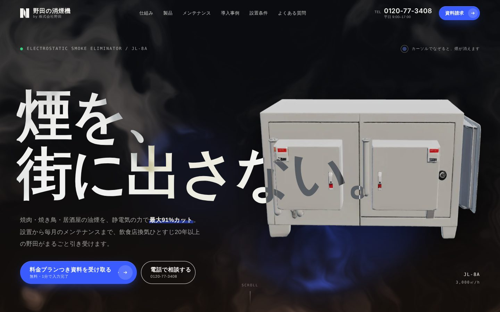

# 野田の消煙機 JL-8A — LPリニューアル

現行LP（https://shoenki.duct-noda.com/ ）のリニューアル版です。
ライブラリやビルドは使わず、HTML / CSS / JavaScript だけで動く静的サイトです。



## プレビュー

リポジトリ直下でローカルサーバーを立てて開いてください（`file://` で直接開くと3D回転の画像読み込みが動かない場合があります）。

```sh
python3 -m http.server 8000
# または
npx serve .
```

→ http://localhost:8000/

スクリーンショットは [`docs/preview/`](docs/preview/) にあります（撮影環境に日本語Webフォントが無いため、代替フォントで表示されています。本番では Google Fonts の Zen Kaku Gothic New が読み込まれます）。

## ページ構成

| # | セクション | 内容 |
|---|---|---|
| — | ファーストビュー | 「煙を、街に出さない。」。背景の煙はWebGLで描画し、カーソル（スマホは指）でなぞった所の煙が消える。スクロールでも煙が晴れていく |
| — | 数字 | 最大91% / 3,000㎥/h / 毎月メンテ / 20年以上 / 100軒以上 |
| 01 | 課題 | 近隣クレーム・外壁の油汚れ・出店審査・管理会社からの改善要求 |
| 02 | 仕組み | 電気集塵の3ステップ（整流 → 12kVで帯電 → 6kVで集塵）をスクロール連動のシミュレーションで表示。稼働動画（クリックでYouTube読み込み） |
| 03 | 製品 | 3Dモデルから書き出した60枚の画像をスクロールで回転表示。特長4点と仕様表 |
| 04 | メリット | 近隣クレーム予防 / 外壁・ダクトの汚れ抑制 / 物件価値の向上 |
| 05 | メンテナンス | 毎月の点検・洗浄・排油・電圧実測。出力電圧の正常値メーター |
| 06 | 導入事例 | 実績の数字、設置写真ギャラリー、事例3件 |
| 07 | 設置条件 | 設置スペースの図（正面0.7m以上）、電源・ダクト・設置方法・使用環境、電気代の目安 |
| 08 | 料金プラン | 購入 / レンタル（料金は資料請求へ誘導） |
| 09 | 導入の流れ | 5ステップ |
| 10 | よくある質問 | 12問 |
| 11 | 資料請求 | フォーム（入力チェック付き）、電話、LINE |

スマホでは画面下に「電話 / LINE / 資料請求」の固定ボタンが出ます。

## 掲載情報について（取扱説明書を優先）

現行LPと取扱説明書（消煙機 JL-8A 取扱説明書）の内容をもとに作成し、両者が食い違う箇所は取扱説明書に合わせました。

| 項目 | 現行LP | リニューアル版（取扱説明書に準拠） |
|---|---|---|
| 消費電力 | 500W | **300W** |
| 電気代の目安 | 月2,500円程度 | **月1,500円程度**（300W × 1日6〜7時間 × 月25日 × 31円/kWh で再計算） |
| 除去の仕組み | meta説明文に「独自フィルター」 | **電気集塵方式**（高電圧部12kV＋低電圧部6kV） |
| フィルター交換 | 継続購入は不要 | 継続購入は不要。ただし説明書の消耗品一覧に合わせ「長期使用で劣化した部品（電極・ガイシなど）は交換が必要な場合あり」と追記 |
| 会社のメール | （記載なし） | info@noda-duct.com（説明書記載） |

説明書から新たに掲載した情報：仕様表（静圧98Pa、重量100kg、電源 単相AC100V 50/60Hz、使用環境 0〜50℃・湿度80%以下）、保証期間1年、メンテナンススペース（正面0.7m以上）、ダクト風速4〜6m/s、チャンバーボックス接続、屋外設置時の防雨カバー（別売）、扉を開けると電源が切れる安全装置、運転ランプの表示、出力電圧の正常値（12kV±2kV / 6kV±2kV）、粉塵の多い工場等では使えない旨。

## 公開前に確認・対応が必要なこと

- **フォームの送信先**：現行LPはWordPress（Elementor）のフォームです。`index.html` の `<form data-endpoint="">` に送信先URLを設定すると、FormData を POST します。未設定のあいだは「プレビューのため送信されません」と表示されます。
- **計測タグ**：現行LPの Google Tag Manager（GTM-W7PSRQTX）は入れていません。公開時に移植してください。
- **会社ドメイン**：説明書のメール・Webは `noda-duct.com`、現行LPのリンク先（会社概要・プライバシーポリシー等）は `duct-noda.com` です。リンクは現行LPのまま、メールは説明書のまま掲載しています。正しい方に揃えてください。
- **OGP画像**：`assets/img/ogp.jpg` はファーストビューのキャプチャです。必要に応じて差し替えてください。

## 画像

- 写真・3Dモデルは現行LPから取得したものです（WebPに変換して軽量化）。
- 製品の回転画像（`assets/img/jl8a/`）は現行LPの3Dモデル（GLB 15MB）から書き出した60枚のWebP（合計約1.6MB）です。再書き出しの手順は [`tools/turntable/render-frames.js`](tools/turntable/render-frames.js) を参照してください。
- 導入事例ギャラリーの小さな写真は、現行LPのサムネイル画像から写真部分を切り出したもので解像度が低めです。

## ファイル構成

```
index.html
assets/
  css/style.css
  js/main.js          煙シェーダー / 集塵シミュレーション / 回転表示 / フォーム など
  img/                写真・製品画像・favicon・OGP
  img/jl8a/           回転表示用フレーム（00〜59.webp）
  img/cases/          導入事例サムネイル
docs/preview/         スクリーンショット
tools/turntable/      3Dモデルから回転フレームを書き出すツール
```

## 実装メモ

- 依存ライブラリなし。WebGLが使えない環境では煙の代わりにCSSのグラデーションが表示されます。
- `prefers-reduced-motion` を尊重し、動きを減らす設定ではアニメーションを止めます。
- 画面外のアニメーションは停止し、回転画像は製品セクションに近づいてから読み込みます。
- 見出しは `word-break: auto-phrase`（対応ブラウザ）で文節単位に改行します。
